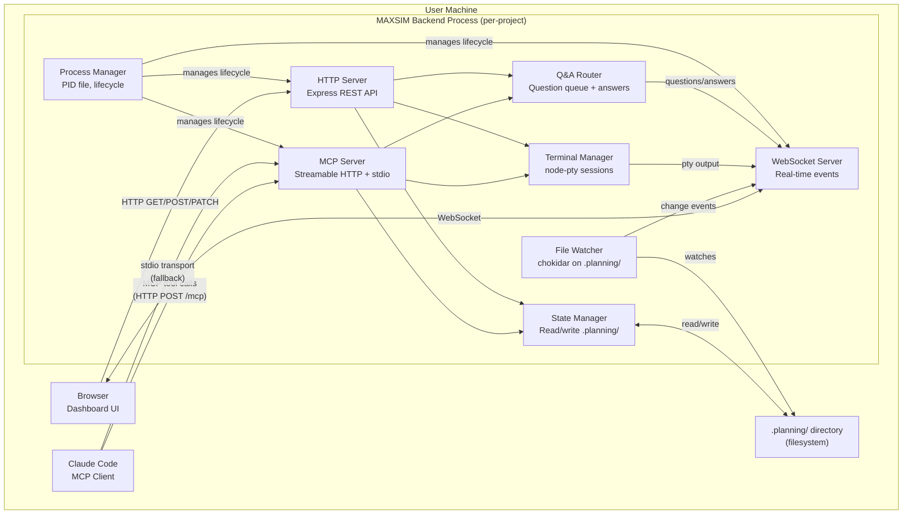
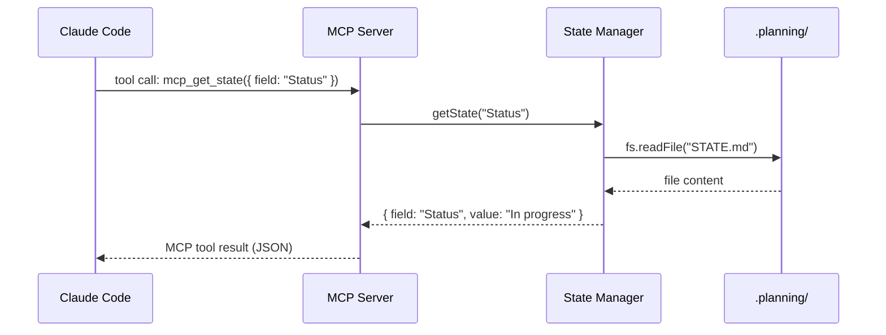
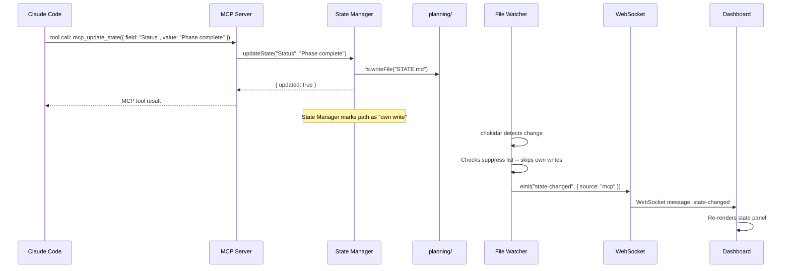
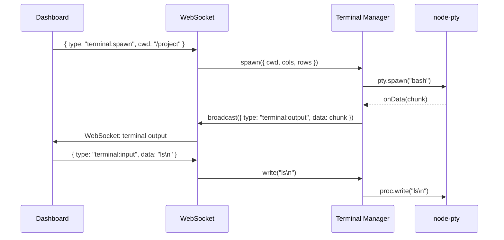
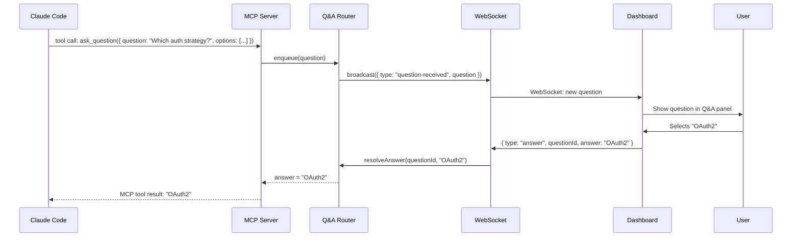

# Phase 3: Backend Architecture Design

## Decision Summary

| Decision | Choice | Rationale |
|----------|--------|-----------|
| Language/Runtime | **Node.js + TypeScript** | npm delivery constraint, existing codebase, MCP SDK native support |
| Package Location | **`packages/backend`** (new package) | Clean separation from CLI and dashboard; shared core via `@maxsim/core` |
| MCP Transport | **Streamable HTTP** (primary) + **stdio** (fallback) | HTTP enables multi-client; stdio for backwards compatibility |
| HTTP Server | **Express 4** | Already used in dashboard; mature, well-understood |
| WebSocket | **ws 8** | Already used in dashboard; proven, lightweight |
| Terminal | **node-pty 1.x** | Already used in dashboard; no viable alternative |
| File Watching | **chokidar 4** | Already used in dashboard; cross-platform, stable |
| Process Management | **PID file + lock** | Simple, no external daemon manager needed |
| Deployment | Ships in npm tarball at `dist/assets/backend/` | Installed to `.claude/backend/` per project |

**Requirements addressed:** BE-01, BE-02, BE-03, BE-04, BE-05, BE-06, DC-01, DC-02, DC-03, DC-04, DC-05, FUT-05

---

## 1. Tech Stack Decision

### Candidates Evaluated

| Criterion | Node.js/TypeScript | Python | Rust | Go |
|-----------|-------------------|--------|------|----|
| npm delivery (`npx maxsimcli@latest`) | Native -- ships as JS in tarball | Requires Python runtime on user machine | Requires prebuilt binaries per platform | Requires prebuilt binaries per platform |
| MCP SDK | `@modelcontextprotocol/sdk` -- first-party, TypeScript-native | `mcp` package exists | Community SDK, immature | Community SDK, immature |
| Codebase compatibility | Entire codebase is TypeScript; shares `@maxsim/core` | Separate codebase; cannot share core modules | Separate codebase; FFI bridge needed | Separate codebase; FFI bridge needed |
| Terminal (pty) | `node-pty` -- native addon, works | `pexpect` / `ptyprocess` -- works | Possible but complex cross-platform | Possible but complex cross-platform |
| WebSocket | `ws` -- battle-tested | `websockets` -- good | `tokio-tungstenite` -- good | `gorilla/websocket` -- good |
| File watching | `chokidar` -- excellent cross-platform | `watchdog` -- good | `notify` -- good | `fsnotify` -- good |
| Developer familiarity | Same team, same language, same tooling | Different ecosystem | Different ecosystem, steep learning curve | Different ecosystem |
| Persistent process overhead | ~30-60MB RSS typical | ~40-80MB RSS typical | ~5-15MB RSS | ~10-25MB RSS |

### Decision: Node.js + TypeScript

**Rationale:** The npm delivery constraint (GUARD-01) is the dominant factor. MAXSIM ships via `npx maxsimcli@latest` -- everything must be in the npm tarball. Adding Rust or Go would require prebuilt binaries for every platform (win-x64, darwin-x64, darwin-arm64, linux-x64, linux-arm64), dramatically complicating the build pipeline and increasing tarball size. Python would require users to have Python installed.

Node.js is the only option that requires zero additional runtime -- users already have Node.js 22+ (see `engines` in package.json). The entire codebase is TypeScript. The MCP SDK (`@modelcontextprotocol/sdk`) is first-party TypeScript. All libraries needed (pty, WebSocket, file watching) are already proven in the dashboard codebase.

The ~30-60MB RSS overhead is acceptable for a per-project development tool that runs during active development sessions.

**Satisfies:** BE-06 (tech stack selected based on fitness for purpose)

---

## 2. Component Diagram



### Component Responsibilities

| Component | Role | Satisfies |
|-----------|------|-----------|
| **MCP Server** | Exposes all MAXSIM tools to Claude Code via MCP protocol. Handles tool calls for phase, state, todo, context operations. | BE-02, BE-03 |
| **HTTP Server** | REST API for dashboard and external tooling. Serves static dashboard assets. | DC-01, DC-02 |
| **WebSocket Server** | Real-time event stream to dashboard: state changes, terminal output, Q&A, lifecycle events. | DC-03, DC-04 |
| **State Manager** | Single source of truth for all `.planning/` file operations. All reads/writes go through this module. | BE-05 |
| **Terminal Manager** | Manages pty sessions (spawn, write, resize, kill). Streams output to WebSocket clients. | BE-04, DC-03 |
| **File Watcher** | Monitors `.planning/` for external changes (e.g., manual edits, git operations). Broadcasts diffs via WebSocket. | DC-02 |
| **Q&A Router** | Routes questions from Claude Code agents to dashboard, waits for user answers, routes answers back. | DC-04, FUT-01 |
| **Process Manager** | PID file management, graceful shutdown, port allocation, health checks. | BE-01, DC-05 |

---

## 3. Data Flow Diagrams

### 3.1 State Read: Claude Code reads project state



### 3.2 State Write: Claude Code updates state, dashboard sees it



### 3.3 Terminal Output: pty streams to dashboard



### 3.4 Q&A Routing: Claude Code asks, user answers via dashboard



---

## 4. API Surface

### 4.1 MCP Tools (exposed to Claude Code)

These are the tools Claude Code can call via the MCP protocol. They merge the current CLI MCP tools with the dashboard MCP tools into a single unified surface.

#### Phase Operations (from `packages/cli/src/mcp/phase-tools.ts`)

| Tool | Description | Parameters |
|------|-------------|------------|
| `mcp_find_phase` | Find a phase by number or name | `phase: string` |
| `mcp_list_phases` | List all phase directories | `include_archived?: boolean` |
| `mcp_create_phase` | Create a new phase | `name: string` |
| `mcp_insert_phase` | Insert a decimal phase after another | `name: string, after: string` |
| `mcp_complete_phase` | Mark a phase complete | `phase: string` |

#### State Operations (from `packages/cli/src/mcp/state-tools.ts`)

| Tool | Description | Parameters |
|------|-------------|------------|
| `mcp_get_state` | Read STATE.md field or section | `field?: string` |
| `mcp_update_state` | Update a STATE.md field | `field: string, value: string` |
| `mcp_add_decision` | Record a decision | `summary: string, rationale?: string, phase?: string` |
| `mcp_add_blocker` | Add a blocker | `text: string` |
| `mcp_resolve_blocker` | Remove a blocker | `text: string` |

#### Todo Operations (from `packages/cli/src/mcp/todo-tools.ts`)

| Tool | Description | Parameters |
|------|-------------|------------|
| `mcp_add_todo` | Create a todo item | `title: string, description?: string, area?: string, phase?: string` |
| `mcp_complete_todo` | Mark a todo complete | `todo_id: string` |
| `mcp_list_todos` | List todos | `area?: string, status?: "pending" \| "completed" \| "all"` |

#### Dashboard/Interaction Operations (from `packages/dashboard/src/mcp-server.ts`)

| Tool | Description | Parameters |
|------|-------------|------------|
| `ask_question` | Present a question to the dashboard user | `question: string, options?: array, allow_free_text?: boolean, conversation_id?: string` |
| `start_conversation` | Start a multi-turn conversation thread | `topic: string` |
| `get_conversation_history` | Get conversation message history | `conversation_id: string` |
| `submit_lifecycle_event` | Broadcast a lifecycle event | `event_type: string, phase_name: string, phase_number: string, step?: number, total_steps?: number` |
| `get_phase_status` | Get question queue and lifecycle state | (none) |

#### New Tools (Phase 4)

| Tool | Description | Parameters |
|------|-------------|------------|
| `mcp_get_context` | Get assembled context for a task type | `task_type: string, phase?: string` |
| `mcp_get_guidelines` | Get project guidelines and decisions | (none) |
| `mcp_get_roadmap` | Get parsed roadmap with phase analysis | (none) |
| `mcp_read_file` | Read a file within `.planning/` | `path: string` |
| `mcp_write_file` | Write a file within `.planning/` | `path: string, content: string` |

### 4.2 HTTP REST Endpoints (for Dashboard)

All endpoints are prefixed at the root. The dashboard connects to `http://localhost:{port}/`.

#### Health & Info

| Method | Path | Description |
|--------|------|-------------|
| `GET` | `/api/health` | Health check with status, cwd, uptime |
| `GET` | `/api/ready` | Readiness probe |
| `GET` | `/api/server-info` | Port, project path, network info |

#### Project Data (read-only for dashboard -- satisfies DC-01)

| Method | Path | Description |
|--------|------|-------------|
| `GET` | `/api/roadmap` | Parsed roadmap with phases, milestones, progress |
| `GET` | `/api/state` | Parsed STATE.md fields and sections |
| `GET` | `/api/phases` | List all phases with disk status |
| `GET` | `/api/phase/:id` | Phase detail: plans, context, research |
| `GET` | `/api/todos` | List pending and completed todos |
| `GET` | `/api/project` | PROJECT.md and REQUIREMENTS.md content |

#### State Mutations (routed through backend State Manager -- satisfies BE-05)

| Method | Path | Description |
|--------|------|-------------|
| `PATCH` | `/api/state` | Update a STATE.md field |
| `PATCH` | `/api/roadmap` | Toggle a roadmap phase checkbox |
| `POST` | `/api/state/decision` | Add a decision to STATE.md |
| `POST` | `/api/state/blocker` | Add a blocker to STATE.md |
| `POST` | `/api/todos` | Create a todo item |
| `PATCH` | `/api/todos/:id` | Complete a todo item |
| `DELETE` | `/api/todos/:id` | Delete a todo item |

#### Terminal

| Method | Path | Description |
|--------|------|-------------|
| `POST` | `/api/terminal/spawn` | Spawn a pty session |
| `DELETE` | `/api/terminal` | Kill the active pty session |
| `GET` | `/api/terminal/status` | Get pty session status |

#### MCP Endpoint

| Method | Path | Description |
|--------|------|-------------|
| `POST` | `/mcp` | Streamable HTTP MCP transport endpoint |

#### Q&A

| Method | Path | Description |
|--------|------|-------------|
| `GET` | `/api/questions` | Get pending question queue |
| `POST` | `/api/questions/:id/answer` | Submit an answer to a question |
| `GET` | `/api/conversations` | List active conversations |
| `GET` | `/api/conversations/:id` | Get conversation history |

### 4.3 WebSocket Event Types

The dashboard connects via `ws://localhost:{port}/ws`. Events flow server-to-client (push) and client-to-server (commands).

#### Server-to-Client Events

| Event Type | Payload | Trigger |
|------------|---------|---------|
| `connected` | `{ timestamp }` | Client connects |
| `file-changes` | `{ changes: string[], timestamp }` | File watcher detects `.planning/` changes |
| `state-changed` | `{ source: "mcp" \| "api" \| "external", fields?: string[] }` | State Manager writes to STATE.md |
| `question-received` | `{ question: PendingQuestion, queueLength }` | MCP `ask_question` called |
| `answer-given` | `{ questionId, conversationId?, remainingQueue }` | User answers a question |
| `conversation-started` | `{ conversation: { id, topic, createdAt } }` | MCP `start_conversation` called |
| `lifecycle` | `{ event }` | MCP `submit_lifecycle_event` called |
| `terminal:output` | `{ data: string }` | pty produces output |
| `terminal:started` | `{ pid }` | pty process spawned |
| `terminal:exit` | `{ code }` | pty process exits |
| `terminal:status` | `{ pid, uptime, cwd, isActive, alive }` | Periodic status (1s interval) |
| `terminal:scrollback` | `{ data: string }` | Sent on client connect (replay buffer) |

#### Client-to-Server Events (via WebSocket messages)

| Event Type | Payload | Action |
|------------|---------|--------|
| `terminal:spawn` | `{ skipPermissions?, cwd?, cols?, rows? }` | Spawn a pty session |
| `terminal:input` | `{ data: string }` | Write to pty stdin |
| `terminal:resize` | `{ cols, rows }` | Resize pty |
| `terminal:kill` | `{}` | Kill pty session |
| `answer` | `{ questionId, answer }` | Submit answer to a pending question |

---

## 5. Library Selection Table

| Concern | Library | Version | Rationale |
|---------|---------|---------|-----------|
| MCP SDK | `@modelcontextprotocol/sdk` | ^1.27.1 | First-party TypeScript SDK. Already a dependency. Supports stdio + Streamable HTTP transports. |
| HTTP Server | `express` | ^4 | Already proven in dashboard. Mature middleware ecosystem. Low risk. |
| WebSocket | `ws` | ^8 | Already proven in dashboard. No-dependency WebSocket implementation. |
| Terminal (pty) | `node-pty` | ^1.1.0 | Already proven in dashboard. Only viable Node.js pty library. Native addon -- requires prebuild or compilation. |
| File Watching | `chokidar` | ^4 | Already proven in dashboard. Cross-platform, handles edge cases (rename, rapid writes). |
| Schema Validation | `zod` | ^3.25.0 | Already used for MCP tool parameter validation. |
| Static File Serving | `sirv` | ^3 | Already used in dashboard. Lightweight, fast. |
| Port Detection | `detect-port` | ^2 | Already used in dashboard. Finds available port near target. |
| Slug Generation | `slugify` | ^1.6.6 | Already used in CLI and dashboard. |
| Debouncing | `lodash.debounce` | ^4.0.8 | Already used in dashboard for file watcher debounce. |
| Logging | Node.js built-in (`console.error` + `fs.createWriteStream`) | N/A | Current dashboard pattern. Adequate for per-project dev tool. No need for heavyweight logging framework. |
| Process Management | PID file (`fs.writeFileSync`) + signal handlers | N/A | Simple, no external dependency. PID written to `.claude/backend/backend.pid`. |

### Why No New Libraries

Every library in the table is already a dependency of either `packages/cli` or `packages/dashboard`. The unified backend introduces zero new dependencies. This is intentional:

- Reduces npm tarball size (no new downloads for users)
- Reduces security surface (no new supply chain risk)
- Reduces integration risk (all libraries are already proven in production)

---

## 6. Migration Path

The migration from the current two-server architecture to a unified backend happens across Phases 4, 6, and 8.

### Current Architecture (v2.0)

```
Claude Code ──stdio──> CLI MCP Server (packages/cli/src/mcp/)
                         └── Reads/writes .planning/ directly

Dashboard Server (packages/dashboard/src/server.ts)
  ├── Express (REST API for dashboard)
  ├── WebSocket (real-time events)
  ├── chokidar (file watcher)
  ├── node-pty (terminal manager)
  ├── Its own MCP Server (ask_question, lifecycle events)
  └── Reads/writes .planning/ directly
```

**Problems:**
1. Two independent processes read/write `.planning/` files -- no single source of truth (violates BE-05)
2. Claude Code MCP tools and dashboard MCP tools are in different codebases
3. Dashboard does its own file I/O -- it is a thick client (violates DC-01)
4. No coordination between CLI MCP and dashboard MCP for Q&A routing

### Phase 4: Build Unified Backend (BE-01 through BE-05)

1. Create `packages/backend/` with the unified server
2. Move State Manager, Terminal Manager, File Watcher, Q&A Router into backend
3. Merge CLI MCP tools (`phase-tools.ts`, `state-tools.ts`, `todo-tools.ts`) and dashboard MCP tools (`mcp-server.ts`) into a single MCP server in the backend
4. Backend exposes Streamable HTTP MCP transport at `/mcp`
5. Backend exposes REST API for dashboard at `/api/*`
6. Backend exposes WebSocket at `/ws`
7. All `.planning/` file access goes through the State Manager
8. CLI MCP server (stdio) remains as a thin proxy that forwards tool calls to the backend's HTTP MCP endpoint, or as a standalone fallback when the backend is not running

**Backwards compatibility:** The CLI `dist/cli.cjs` stdio MCP server continues to work independently for users who do not start the backend. This ensures GUARD-01 and GUARD-02 are not violated.

### Phase 6: Dashboard Thin Client (DC-01 through DC-04)

1. Remove all file I/O from dashboard server.ts
2. Dashboard React app fetches data exclusively from backend REST API
3. Dashboard connects to backend WebSocket for real-time events
4. Terminal view connects to backend's terminal manager
5. Q&A panel routes through backend
6. Dashboard becomes a pure static SPA served by the backend

### Phase 8: Integration (cleanup)

1. Remove dashboard's own Express server (it is now just a static build)
2. Ensure `maxsimcli dashboard` starts the backend (which serves the dashboard SPA)
3. End-to-end testing of the full flow
4. Remove duplicate parsing code from dashboard

### Migration Risk Mitigation

- **Incremental:** Each phase is independently deployable. Phase 4 can ship without Phase 6.
- **Fallback:** CLI stdio MCP server continues to work even if backend is not running.
- **No breaking changes:** All existing `/maxsim:*` commands continue to work through CLI stdio MCP or through the backend MCP (GUARD-02).
- **File format unchanged:** `.planning/` file formats are not modified (GUARD-03).

---

## 7. Package Structure

### Decision: New `packages/backend` Package

```
packages/backend/
├── src/
│   ├── index.ts              # Entry point: bootstrap and start server
│   ├── server.ts             # HTTP + WebSocket + MCP server setup
│   ├── mcp/
│   │   ├── index.ts          # Register all MCP tools
│   │   ├── phase-tools.ts    # Phase CRUD tools (moved from cli)
│   │   ├── state-tools.ts    # State management tools (moved from cli)
│   │   ├── todo-tools.ts     # Todo CRUD tools (moved from cli)
│   │   ├── interaction-tools.ts  # ask_question, conversations, lifecycle (moved from dashboard)
│   │   └── context-tools.ts  # New: get_context, get_guidelines, get_roadmap
│   ├── managers/
│   │   ├── state-manager.ts  # Single source of truth for .planning/ I/O
│   │   ├── terminal-manager.ts   # pty session management (moved from dashboard)
│   │   ├── file-watcher.ts   # chokidar watcher (moved from dashboard)
│   │   └── qa-router.ts      # Question queue and answer routing
│   ├── routes/
│   │   ├── health.ts         # /api/health, /api/ready
│   │   ├── roadmap.ts        # /api/roadmap
│   │   ├── state.ts          # /api/state
│   │   ├── phases.ts         # /api/phases, /api/phase/:id
│   │   ├── todos.ts          # /api/todos
│   │   ├── terminal.ts       # /api/terminal/*
│   │   └── questions.ts      # /api/questions/*
│   └── lib/
│       ├── process.ts        # PID file management, port allocation
│       ├── logger.ts         # Structured logging to file
│       └── ws-broadcast.ts   # WebSocket broadcast utility
├── tsdown.config.mts         # Build config
├── package.json
└── tsconfig.json
```

### Why Not Inside `packages/cli`?

The CLI package (`maxsimcli`) is the npm-published package. Its `dist/cli.cjs` is a tools router invoked by Claude Code via Bash. Its `dist/install.cjs` is the installer. Adding a persistent server to this package would:
- Conflate two different execution models (CLI tool vs. long-running daemon)
- Make the CLI entrypoint more complex
- Create confusion about what `maxsimcli` is (a CLI tool or a server?)

### Why Not Merged With Dashboard?

The dashboard package is a Vite+React frontend. Merging the backend into it would:
- Re-create the current thick-client problem
- Make the dashboard package responsible for both UI and backend logic
- Prevent the dashboard from being a pure SPA

### Shared Core

The backend imports from `@maxsim/core` (aliased to `packages/cli/src/core/`) just like the dashboard does today. This is the same path-alias pattern already established:

```typescript
// packages/backend/src/managers/state-manager.ts
import { stateExtractField, stateReplaceField } from '@maxsim/core';
```

The core modules (`state.ts`, `core.ts`, `phase.ts`, `roadmap.ts`, etc.) remain in `packages/cli/src/core/` and are shared by all three packages.

---

## 8. Deployment Model

### Build Pipeline

```
npm run build
  ├── packages/cli     → dist/cli.cjs, dist/install.cjs
  ├── packages/backend → dist/backend.js (tsdown bundle)
  ├── packages/dashboard → dist/client/ (Vite SPA) + dist/server.js (removed in Phase 8)
  └── copy-assets.cjs
        ├── copies templates/ → dist/assets/templates/
        ├── copies dashboard build → dist/assets/dashboard/
        └── copies backend build → dist/assets/backend/
```

The backend is bundled by `tsdown` into a single `backend.js` file (CommonJS, same pattern as `cli.cjs` and dashboard's `server.js`). This file is copied into `packages/cli/dist/assets/backend/` by `copy-assets.cjs`.

### npm Tarball Contents

```
maxsimcli/
├── dist/
│   ├── install.cjs           # Installer entry point
│   ├── cli.cjs               # CLI tools router
│   └── assets/
│       ├── templates/         # Markdown commands, agents, workflows
│       ├── hooks/             # Compiled hook scripts
│       ├── dashboard/
│       │   ├── client/        # Vite SPA build
│       │   └── server.js      # Dashboard server (Phase 4-6: still exists; Phase 8: removed)
│       └── backend/
│           └── backend.js     # Unified backend server
└── README.md
```

### Installation Flow

When the user runs `npx maxsimcli@latest` in their project:

1. `install.cjs` runs the standard MAXSIM install (templates, hooks, agents)
2. `install.cjs` copies `dist/assets/backend/backend.js` to `.claude/backend/backend.js`
3. `install.cjs` writes a `.claude/backend/package.json` with `node-pty` as a dependency (native addon must be compiled/installed locally)
4. `install.cjs` runs `npm install` in `.claude/backend/` to install `node-pty` prebuilds

### Startup Flow

```
maxsimcli start
  └── Checks if backend is already running (reads .claude/backend/backend.pid)
      ├── If running: prints "Backend already running on port XXXX"
      └── If not running:
          ├── Spawns: node .claude/backend/backend.js
          ├── Sets env: MAXSIM_PROJECT_CWD=<project-root>
          ├── Backend writes PID to .claude/backend/backend.pid
          ├── Backend resolves port (deterministic from project path, range 3100-3199)
          ├── Backend starts: MCP server + HTTP + WebSocket + file watcher
          ├── Backend serves dashboard SPA at /
          └── Prints: "MAXSIM running at http://localhost:XXXX"
```

**Satisfies:** FUT-05 (`maxsimcli start` -- single command starts Backend + Dashboard)

### Auto-Start via Claude Code Hook

A Claude Code hook (installed to `.claude/hooks/`) can auto-start the backend when Claude Code opens a project:

```json
{
  "hooks": {
    "ProjectOpened": [{
      "type": "command",
      "command": "node .claude/backend/backend.js --background"
    }]
  }
}
```

This is optional and can be enabled via `.planning/config.json`:

```json
{
  "backend": {
    "auto_start": true
  }
}
```

### Claude Code MCP Configuration

The backend registers itself as an MCP server in Claude Code's configuration. During install, `install.cjs` adds an entry to `.claude/settings.json`:

```json
{
  "mcpServers": {
    "maxsim": {
      "url": "http://localhost:{port}/mcp"
    }
  }
}
```

When the backend is not running, Claude Code falls back to the stdio MCP server (the existing `cli.cjs` based server). This fallback ensures GUARD-01 is maintained.

### Multi-Project Support (DC-05)

Each project gets:
- Its own backend process (separate PID file at `.claude/backend/backend.pid`)
- Its own deterministic port (hashed from project path, range 3100-3199)
- Its own `.planning/` directory
- Complete isolation -- no shared state between projects

The `listRunningDashboards()` function (already implemented in `server.ts`) scans ports 3100-3199 to discover running instances. This pattern is preserved in the backend.

### Graceful Shutdown

```
Process receives SIGTERM or SIGINT
  ├── Close WebSocket connections (send "shutdown" event)
  ├── Close HTTP server (stop accepting new connections)
  ├── Kill pty session (if active)
  ├── Close file watcher
  ├── Remove PID file
  └── Exit with code 0
```

---

## Appendix A: Requirement Traceability

| Requirement | How Addressed |
|-------------|--------------|
| BE-01 | Backend runs as persistent per-project process with PID file management |
| BE-02 | All MCP tools (phase, state, todo, interaction) registered on single MCP server |
| BE-03 | Context tools (`mcp_get_context`, `mcp_get_guidelines`) serve project context via MCP |
| BE-04 | Terminal Manager handles pty lifecycle, streams output via WebSocket |
| BE-05 | State Manager is single source of truth; all file I/O goes through it |
| BE-06 | Node.js/TypeScript selected with documented rationale (Section 1) |
| DC-01 | Dashboard reads all data from backend REST API; zero direct file access |
| DC-02 | Dashboard renders roadmap, phases, state from backend API responses |
| DC-03 | Terminal view streams from backend-managed pty via WebSocket |
| DC-04 | Q&A panel routes questions through backend Q&A Router |
| DC-05 | Each project runs independent backend on deterministic port |
| FUT-05 | `maxsimcli start` spawns backend which serves dashboard |
| GUARD-01 | npm install flow unchanged; backend ships in tarball |
| GUARD-02 | All `/maxsim:*` commands continue to work via CLI or backend MCP |
| GUARD-03 | `.planning/` file formats unchanged |
| GUARD-04 | Backend ships in npm package at `dist/assets/backend/` |
